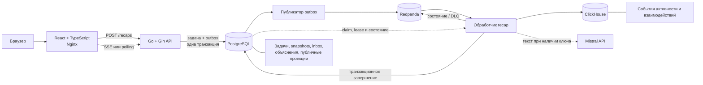

# Avito Recap City

Персональные «Итоги года» для пользователей Авито в формате интерактивного города. Активность пользователя превращается в связную историю: метрики, главный район, роль, стиль, достижения, объяснения и безопасную карточку для публикации.

## Проблема

За год пользователь совершает множество разрозненных действий: смотрит объявления, добавляет их в избранное, публикует предложения, общается и завершает сделки. Сырые счётчики плохо передают ценность этой активности, а прямой показ подробных действий может нарушать приватность.

Проект решает две задачи:

- помогает пользователю увидеть свой год как понятную и эмоциональную историю;
- создаёт для Авито дополнительную точку возврата, досмотра и безопасного шеринга.

## Идея решения

Мы представляем Авито как город пользователя:

- вертикаль продукта становится районом;
- категория становится улицей;
- интенсивность активности влияет на визуальную застройку;
- роль, стиль и достижения объясняют поведение пользователя за год.

Бизнес-факты, архетип и достижения вычисляются детерминированными правилами. Mistral используется только для короткой суммаризации поверх заранее разрешённых фактов. При отсутствии ключа или ошибке внешнего API бэкенд автоматически возвращает воспроизводимый шаблонный текст.

## Статус проекта

На хакатоне команда собрала рабочий синхронный MVP: пользователь выбирал профиль, запускал генерацию и получал готовые итоги с интерактивным городом. Асинхронные обработчики, Redpanda, outbox и inbox, SSE и нагрузочные тесты были добавлены уже после хакатона как отдельная инженерная доработка. Подробный план этой доработки изначально был зафиксирован как период после MVP.

## Что реализовано на хакатоне

- выбор одного из тестовых профилей;
- генерация recap для пары `profile_id + year`;
- повторный запрос возвращает сохранённый неизменяемый snapshot;
- интерактивный изометрический город на Canvas;
- карточки с активными днями, ключевой метрикой, главным районом, ролью и стилем;
- персональные достижения с уровнями;
- отдельный endpoint с объяснением решений;
- безопасная публичная share-проекция;
- обработка недостаточной активности и технических ошибок;
- запись продуктовых interaction events;
- шаблонный текст при недоступном Mistral;
- модульные тесты, линтеры и GitHub Actions CI;
- запуск всего стека через Docker Compose.

## Что добавлено после хакатона

- асинхронный `POST /recaps` со статусами `queued / processing / ready / failed`;
- отдельный обработчик задач с повторными попытками, lease, heartbeat и увеличивающейся задержкой между попытками;
- транзакционное создание задачи и outbox-события;
- Redpanda, inbox потребителя и DLQ;
- SSE с автоматическим переходом на polling;
- транзакционное сохранение snapshot и статуса `ready`;
- конкурентные тесты и тесты отказоустойчивости;
- воспроизводимые сценарии нагрузочного тестирования;
- разбиение крупных обработчиков бэкенда на небольшие функции.

## Текущая архитектура

Ниже показана текущая версия проекта с доработками после хакатона.



### Поток генерации

1. Фронтенд получает список профилей через `GET /api/v1/profiles`.
2. `POST /api/v1/recaps` одной транзакцией создаёт задачу и запись outbox, затем возвращает `202 Accepted`.
3. Публикатор outbox отправляет команду в Redpanda.
4. Обработчик получает команду или подбирает задачу из PostgreSQL в режиме восстановления.
5. Обработчик читает активность из ClickHouse, считает метрики и применяет правила персонализации.
6. Модуль текста использует Mistral или шаблонный текст.
7. Готовый recap и статус `ready` сохраняются одной транзакцией PostgreSQL.
8. Фронтенд получает прогресс через SSE, а при разрыве соединения продолжает polling.

## Технологии

| Область | Технологии |
|---|---|
| Фронтенд | React 19, TypeScript 6, Vite 8, React Router, Canvas API |
| Бэкенд | Go 1.23, Gin, `database/sql`, HTTP-клиент |
| Хранилища | PostgreSQL 15, ClickHouse 24.8 |
| ИИ | Mistral Chat Completions API, JSON Schema, шаблонный текст |
| Контракты | OpenAPI 3.0.3 |
| Инфраструктура | Docker, Docker Compose, Nginx, Redpanda HTTP Proxy |
| Качество | тесты Go, `go vet`, `gofmt`, тестовый runner Node.js, ESLint, Prettier, GitHub Actions |

## Быстрый запуск

### Требования

- Docker Engine;
- Docker Compose v2.

### Запуск всего приложения

```bash
git clone https://github.com/inxrius/avito-hackathon.git
cd avito-hackathon

docker compose up -d --build
```

После запуска:

- фронтенд: http://localhost:5173
- API бэкенда: http://localhost:8080/api/v1

Проверка состояния:

```bash
docker compose ps
curl http://localhost:8080/api/v1/profiles
```

Обработчик задач и публикатор outbox не публикуют внешние порты. Количество обработчиков можно менять независимо от API:

```bash
docker compose up -d --scale worker=3
```

Остановка:

```bash
docker compose down
```

Полный сброс локальных данных и повторное применение тестовых миграций:

```bash
docker compose down -v
docker compose up -d --build
```

## Ключ Mistral API

В репозитории **нет ключа Mistral API**. По умолчанию `MISTRAL_API_KEY` пустой, поэтому проект работает с шаблонной суммаризацией. Для проверки основного сценария ключ не требуется.

Чтобы локально включить Mistral и не коммитить секрет, создайте файл `.env` в корне репозитория:

```env
MISTRAL_API_KEY=<your-key>
```

И локальный `docker-compose.override.yml`:

```yaml
services:
  backend:
    environment:
      MISTRAL_API_KEY: ${MISTRAL_API_KEY}
  worker:
    environment:
      MISTRAL_API_KEY: ${MISTRAL_API_KEY}
```

Оба файла исключены из Git. После этого запустите:

```bash
docker compose up -d --build --force-recreate backend worker frontend
```

В ответе нового recap поле `generation.narrative.source` будет равно `mistral`. Для уже сохранённого snapshot источник не меняется; для чистой проверки можно выполнить `docker compose down -v`.

## API

Канонический контракт находится в [`docs/openapi.yaml`](docs/openapi.yaml).

| Метод | Путь | Назначение |
|---|---|---|
| `GET` | `/api/v1/profiles` | Список профилей и доступных годов |
| `GET` | `/api/v1/profiles/{id}` | Получение профиля |
| `POST` | `/api/v1/recaps` | Создать асинхронную задачу или вернуть готовый recap |
| `GET` | `/api/v1/recaps/{id}` | Получить состояние задачи или готовый recap |
| `GET` | `/api/v1/recaps/{id}/stream` | SSE-события `status`, `ready`, `failed` |
| `GET` | `/api/v1/recaps/{id}/explanation` | Объяснение роли, стиля и достижений |
| `GET` | `/api/v1/recaps/{id}/share` | Безопасная публичная проекция |
| `POST` | `/api/v1/recaps/{id}/interactions` | Запись продуктового события |

Пример генерации:

```bash
curl -X POST http://localhost:8080/api/v1/recaps \
  -H 'Content-Type: application/json' \
  -d '{
    "profile_id": "11111111-1111-1111-1111-111111111111",
    "year": 2026
  }'
```

Новый или выполняющийся запрос возвращает `202 Accepted` со статусом, `links.stream` и `poll_after_ms`. После завершения SSE присылает событие `ready`, а `GET /recaps/{id}` возвращает готовый snapshot; повторный `POST` возвращает его с `200 OK`.

## Структура проекта

```text
.
├── .github/workflows/       # проверки GitHub Actions
├── backend/
│   ├── cmd/server/          # HTTP API и SSE
│   ├── cmd/worker/          # обработчик задач
│   ├── cmd/outbox/          # публикация outbox-событий
│   ├── cmd/bench-*/         # генерация нагрузки и отчётов
│   ├── internal/
│   │   ├── config/          # конфигурация
│   │   ├── handler/         # HTTP-обработчики
│   │   ├── model/           # модели API и хранения
│   │   ├── recap/           # аналитика, правила и текст
│   │   ├── repository/      # PostgreSQL и ClickHouse
│   │   ├── broker/          # клиент Redpanda HTTP Proxy
│   │   ├── eventing/        # контракты событий
│   │   ├── outbox/          # цикл публикации
│   │   ├── service/         # сценарии приложения
│   │   └── worker/          # retry, lease и обработка команд
│   ├── migrations/          # схемы и тестовые данные
│   └── Dockerfile
├── frontend/
│   ├── src/
│   │   ├── app/             # роутер и оболочка
│   │   ├── pages/           # выбор профиля, генерация, recap и share
│   │   ├── entities/city/   # Canvas-город
│   │   ├── widgets/         # публичная карточка
│   │   └── shared/          # API, типы и утилиты
│   ├── nginx.conf           # SPA и прокси `/api`
│   └── Dockerfile
├── bench/                   # описание и результаты нагрузочных тестов
├── scripts/                 # сценарии нагрузки и отказов
├── docs/                    # API, хранение и асинхронный контур
├── context/                 # краткий контекст проекта
└── docker-compose.yml       # локальный стенд
```

## Особенности реализации

### Воспроизводимость

Одинаковые события, год и версия алгоритма дают одинаковые метрики, роль, стиль и достижения. Готовый результат хранит версию алгоритма и хеш активности, а город получает детерминированный seed.

### Хранилища

- PostgreSQL хранит профили, состояние генерации и готовые snapshots;
- ClickHouse хранит события активности и продуктовой аналитики;
- Redpanda передаёт внутренние команды, но не хранит состояние задачи.

### Объяснимость и ИИ

Роль, стиль и достижения выбираются правилами. Mistral получает только разрешённые факты и формирует короткий текст. Ответ проверяется, а при любой ошибке используется шаблон.

### Приватность

Публичная карточка формируется отдельно и содержит только разрешённые поля. Личные объяснения и внутренние метрики в неё не попадают.

### Надёжность асинхронной версии

Задача и outbox-событие создаются одной транзакцией. Worker использует `FOR UPDATE SKIP LOCKED`, lease и проверку владельца. Повторные команды отсеиваются через inbox. Snapshot и статус `ready` также сохраняются одной транзакцией.

### SSE и polling

API отправляет прогресс через Server-Sent Events. Если соединение разрывается, фронтенд продолжает получать состояние через обычный `GET`.

### Нагрузочные тесты

Команды `make bench-smoke`, `make bench-paths`, `make bench-matrix` и `make bench-faults` сохраняют исходные результаты и сведения об окружении в `bench/results/`.

## Тесты и CI

Локальные проверки:

```bash
cd backend
gofmt -w ./cmd ./internal ./pkg
go vet ./...
go test ./...

cd ../frontend
npm ci
npm run check
```

`npm run check` последовательно запускает тесты фронтенда, ESLint и production-сборку.

GitHub Actions выполняет:

- проверку форматирования, `go vet` и модульные тесты бэкенда;
- race-тесты worker, outbox и broker;
- интеграционные тесты PostgreSQL для конкурентного claim, lease, outbox и inbox;
- тесты фронтенда, lint и production-сборку;
- smoke-тест Docker с Redpanda, двумя workers, SSE и сценариями временной недоступности сервисов.

## Ограничения и дальнейшее развитие

Текущий интерфейс подробно показывает главный район пользователя. Следующий продуктовый шаг — передавать безопасное распределение активности по нескольким вертикалям и одновременно строить несколько полноценных районов в CityCanvas.

Другие возможные направления:

- отдельный сервис аналитики и gRPC только при необходимости независимого масштабирования;
- материализованные представления ClickHouse для массовой предгенерации после измерений;
- кластерные Redpanda и ClickHouse;
- полноценные метрики и трассировка.

Асинхронный контур уже реализован после хакатона, но решение о его использовании в промышленной среде должно опираться на результаты нагрузочных тестов.

## Команда и распределение ответственности

| Участник | GitHub | Основной вклад |
|---|---|---|
| Александр Цыков | `At0-m` | Продуктовая и техническая архитектура, OpenAPI, recap domain и analytics, правила персонализации, narrative/Mistral, сборка pipeline, интеграция backend с PostgreSQL/ClickHouse, стабилизация E2E, финальная frontend-полировка, тесты, CI и Docker Compose |
| Станислав Шегай | `inxrius` | Инициализация репозитория, backend models, repository/service/HTTP layers, годовая фильтрация активности, интеграция generator pipeline|
| Дмитрий | `DemiusHTTV` | Фронтенд и пользовательский сценарий, интерактивный Canvas-город, страницы и компоненты recap, адаптация фронтенда к реальному контракту бэкенда |
| Роман Карелин | `mamooin` | Восстановление и структурирование требований, ранние архитектурные решения, документация OpenAPI и модели базы данных |

Зоны ответственности пересекались: архитектурные решения, интеграция контрактов, тестирование и финальная стабилизация выполнялись совместно через ревью и Pull Request.

## История разработки

Хакатонная разработка велась в персональных ветках с Pull Request в `dev`. Основные этапы:

1. восстановление требований, OpenAPI и модели данных;
2. аналитика, правила персонализации и pipeline формирования текста;
3. слои repository, service и HTTP и подключение PostgreSQL/ClickHouse;
4. фронтенд с детерминированным Canvas-городом;
5. согласование контракта фронтенда и бэкенда и сквозной сценарий;
6. резервный шаблон Mistral, interaction events, публичная карточка и объяснения;
7. тесты, CI и Docker Compose.

После хакатона отдельным этапом были добавлены транзакции, асинхронные обработчики, Redpanda, SSE, нагрузочные тесты и тесты отказоустойчивости.

Краткая хронология ключевых коммитов находится в [`docs/commit-history.md`](docs/commit-history.md). Полную историю можно посмотреть командой:

```bash
git log --oneline --graph --decorate --all
```

## Документация

- [`docs/openapi.yaml`](docs/openapi.yaml) — публичный API;
- [`docs/async-generation.md`](docs/async-generation.md) — асинхронная генерация;
- [`docs/event-contracts.md`](docs/event-contracts.md) — события Redpanda;
- [`docs/database-models.md`](docs/database-models.md) — модель хранения;
- [`docs/final-async-stage.md`](docs/final-async-stage.md) — доработка после хакатона;
- [`docs/commit-history.md`](docs/commit-history.md) — ключевые коммиты и вклад команды;
- [`bench/README.md`](bench/README.md) — нагрузочные тесты и тесты отказоустойчивости;
- [`docs/git-workflow.md`](docs/git-workflow.md) — работа с ветками и Pull Request;
- [`docs/task.md`](docs/task.md) — исходное задание;
- [`context/PROJECT_CONTEXT.md`](context/PROJECT_CONTEXT.md) — краткий контекст проекта.
